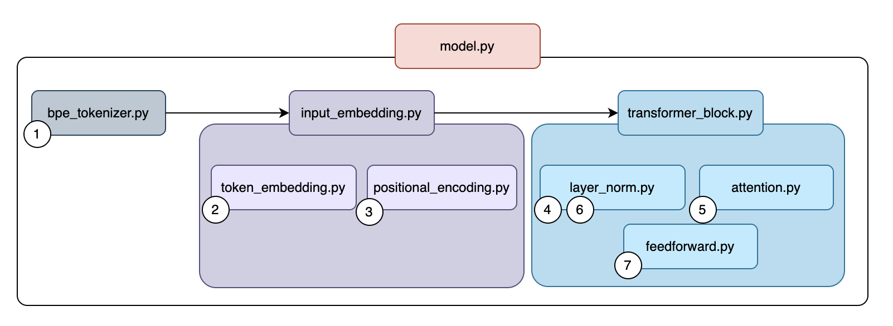

# GPT-Style Model from Scratch

<p align="center">
  
</p>

[](#)
[](#)

[](#)


[](https://github.com/psf/black)
[](#)


> Author: [Daniel Puente Viejo](https://www.linkedin.com/in/danielpuenteviejo/)

A complete implementation of a GPT-style decoder-only transformer built from scratch in PyTorch. This project includes modular components, training scripts, and interactive notebooks for learning and experimentation.

## 📁 Project Structure

```
transformer/
├── config/                 # Configuration files
├── data/                   # Training data
├── checkpoints/            # Saved model checkpoints
├── logs/                   # Training logs
├── notebooks/              # Educational notebooks of each .py of components/ folder
└── src/                    # Source code
    ├── components/         # Transformer components
    ├── train_pretrain.py   # Training script with text files
    ├── train_finetune.py   # Fine-tuning script with RLHF data (CSV)
    ├── inference.ipynb     # Test the model in a notebook
    └── inference.py        # Inference script
```

## 🧩 Understanding the Components (Bottom-Up Order)

### 1. Basic Building Blocks (Independent)

Start here to understand the fundamentals:

- **[notebooks/bpe_tokenizer.ipynb](notebooks/bpe_tokenizer.ipynb)** → [src/components/bpe_tokenizer.py](src/components/bpe_tokenizer.py)
  - Byte-Pair Encoding tokenizer implementation
  - Converts text to tokens and vice versa

- **[notebooks/token_embedding.ipynb](notebooks/token_embedding.ipynb)** → [src/components/token_embedding.py](src/components/token_embedding.py)
  - Converts token IDs to dense vectors
  - Learnable embedding layer

- **[notebooks/positional_encoding.ipynb](notebooks/positional_encoding.ipynb)** → [src/components/positional_encoding.py](src/components/positional_encoding.py)
  - Adds position information to embeddings
  - Uses sinusoidal encoding

- **[notebooks/layer_norm.ipynb](notebooks/layer_norm.ipynb)** → [src/components/layer_norm.py](src/components/layer_norm.py)
  - Layer normalization for stabilizing training
  - Normalizes across feature dimension

- **[notebooks/attention.ipynb](notebooks/attention.ipynb)** → [src/components/attention.py](src/components/attention.py)
  - Multi-head causal self-attention mechanism
  - Core of the transformer architecture

- **[notebooks/feedforward.ipynb](notebooks/feedforward.ipynb)** → [src/components/feedforward.py](src/components/feedforward.py)
  - Position-wise feed-forward network (MLP)
  - Expands then contracts feature dimension

### 2. Combined Components (Mix of Multiple Files)

These combine the basic blocks:

- **[notebooks/input_embeddings.ipynb](notebooks/input_embeddings.ipynb)** → [src/components/input_embeddings.py](src/components/input_embeddings.py)
  - **Combines:** `token_embedding.py` + `positional_encoding.py`
  - Complete input processing: tokens → embeddings → positional encoding

- **[notebooks/transformer_block.ipynb](notebooks/transformer_block.ipynb)** → [src/components/transformer_block.py](src/components/transformer_block.py)
  - **Combines:** `attention.py` + `feedforward.py` + `layer_norm.py`
  - Single transformer layer with residual connections
  - Architecture: LayerNorm → Attention → Add → LayerNorm → FFN → Add

### 3. Complete Model (Everything Together)

- **[notebooks/model.ipynb](notebooks/model.ipynb)** → [src/components/model.py](src/components/model.py)
  - **Combines:** `input_embeddings.py` + `transformer_block.py` (stacked N times)
  - Full GPT-style decoder-only transformer
  - Includes final layer norm and language modeling head

## 🎓 How Training Works (Simple Explanation)

### The Core Idea: Predict the Next Word

The model learns by playing a simple game: **"Given these words, what comes next?"**

#### Example

```
Text: "The cat sat on the mat"

Training examples created automatically:
```

<div align="center">

| **Input (see)** | **Target (guess)** |
|-----------------|-------------------|
| "The" | "cat" |
| "The cat" | "sat" |
| "The cat sat" | "on" |
| "The cat sat on" | "the" |
| ... | ... |

</div>

### The Training Loop

```
┌─────────────────────────────────────────┐
│  1. Get batch of text                   │
│     ["The cat sat..."]                  │
│                                         │
│  2. Convert to numbers (tokens)         │
│     [23, 45, 89, 12, ...]               │
│                                         │
│  3. Model makes prediction              │
│     "sat" → 60% confidence ✓            │
│                                         │
│  4. Calculate error (loss)              │
│     Loss = how wrong was the guess?     │
│                                         │
│  5. Update weights (backpropagation)    │
│     Adjust millions of numbers slightly │
│                                         │
│  6. Repeat millions of times            │
│     Until predictions improve           │
└─────────────────────────────────────────┘
```

### What the Model Learns

<div align="center">

| **After Training** | **Example** |
|-------------------|-------------|
| Grammar | "The cat sat" not "cat The sat" |
| Facts | "Michael Jordan won 6 championships" |
| Context | "basketball" follows "NBA" |
| Style | How to answer questions |

</div>

### Key Points

- **No human labels needed** → The text itself teaches the model
- **Causal masking** → Model can only look at past words, not future
- **Self-supervised** → Creates its own training data from raw text

## 🚀 Training Pipeline

### Step 1: Pre-training
**File:** [src/train_pretrain.py](src/train_pretrain.py)

Trains the model on raw text data using causal language modeling (predict next token).

```bash
python src/train_pretrain.py
```

**Uses:**
- Data: [data/data.txt](data/data.txt)
- Config: [config/config.json](config/config.json)
- Saves: `checkpoints/model_epoch{N}.pt`

### Step 2: Fine-tuning (Optional)
**File:** [src/train_finetune.py](src/train_finetune.py)

Fine-tunes the pre-trained model on prompt-response pairs with ratings (1-5).

```bash
python src/train_finetune.py
```

**Uses:**
- Data: [data/fine_tune_data.csv](data/fine_tune_data.csv) (columns: prompt, response, rating)
- Pre-trained checkpoint: [checkpoints/model_epoch5.pt](checkpoints/model_epoch5.pt)
- Saves: `checkpoints/model_finetuned_epoch{N}.pt`

### Step 3: Inference
**File:** [src/inference.py](src/inference.py) or [src/inference.ipynb](src/inference.ipynb)

Generate text using the trained model.

```bash
python src/inference.py
```

## 📚 Learning Path

Follow this order to understand the transformer architecture:
0. **Tokenizer** (BPE Tokenizer)
    - Learn how text is converted to tokens

1. **Start with basics:**
   - Token Embedding → Positional Encoding → Layer Norm
   
2. **Learn the core mechanisms:**
   - Attention (how tokens interact)
   - Feedforward (processing each position)
   
3. **See how they combine:**
   - Input Embeddings (token + position)
   - Transformer Block (attention + FFN)
   
4. **Understand the full architecture:**
   - Model (stack of transformer blocks)
   
5. **Run the system:**
   - Training scripts → Inference

## ⚙️ Configuration

Edit [config/config.json](config/config.json) to adjust:

```json
{
  "model": {
    "vocab_size": 1000,      // Vocabulary size
    "d_model": 128,          // Embedding dimension
    "n_heads": 4,            // Number of attention heads
    "n_layers": 4,           // Number of transformer blocks
    "d_ff": 512,             // Feedforward hidden dimension
    "max_seq_len": 64,       // Maximum sequence length (window size)
    "dropout": 0.1           // Dropout rate
  },
  "training": {
    "batch_size": 8,
    "learning_rate": 0.0003,
    "n_epochs": 5,
    "device": "cpu"
  }
}
```

## 📊 Files That Combine Multiple Components

Quick reference for which files are combinations:

- **input_embeddings.py** = token_embedding.py + positional_encoding.py
- **transformer_block.py** = attention.py + feedforward.py + layer_norm.py
- **model.py** = input_embeddings.py + transformer_block.py (×N) + final layer norm

## 🎯 Key Features

- ✅ Built entirely from scratch (no high-level transformer libraries)
- ✅ Modular design with clear separation of components
- ✅ Educational notebooks for each component
- ✅ Complete training pipeline (pre-training + fine-tuning)
- ✅ BPE tokenizer implementation
- ✅ Causal self-attention for autoregressive generation
- ✅ Pre-LayerNorm architecture for training stability
- ✅ Weight tying between embeddings and output head

## 🛠️ Requirements

- Python 3.13.5
- PyTorch
- pandas (for fine-tuning)
- loguru (logging)
- tqdm (progress bars)

## 📦 Installation

```bash
pip install -r requirements.txt
```

## 📝 Notes

- The model uses a decoder-only (GPT-style) architecture
- Causal masking ensures autoregressive generation
- Checkpoints include model weights, optimizer state, and config
- Tokenizer is trained and saved separately